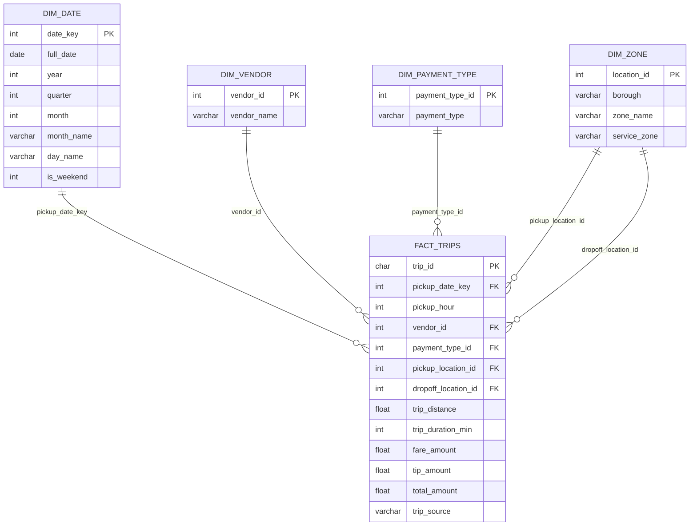

# Gold star schema (ERD)

Grain of `fact_trips`: one row per trip. `dim_zone` is a role-playing dimension (pickup and dropoff).

```mermaid
erDiagram
    DIM_DATE         ||--o{ FACT_TRIPS : "pickup_date_key"
    DIM_VENDOR       ||--o{ FACT_TRIPS : "vendor_id"
    DIM_PAYMENT_TYPE ||--o{ FACT_TRIPS : "payment_type_id"
    DIM_ZONE         ||--o{ FACT_TRIPS : "pickup_location_id"
    DIM_ZONE         ||--o{ FACT_TRIPS : "dropoff_location_id"

    FACT_TRIPS {
        char trip_id PK
        int pickup_date_key FK
        int pickup_hour
        int vendor_id FK
        int payment_type_id FK
        int pickup_location_id FK
        int dropoff_location_id FK
        float trip_distance
        int trip_duration_min
        float fare_amount
        float tip_amount
        float total_amount
        varchar trip_source
    }
    DIM_DATE {
        int date_key PK
        date full_date
        int year
        int quarter
        int month
        varchar month_name
        varchar day_name
        int is_weekend
    }
    DIM_ZONE {
        int location_id PK
        varchar borough
        varchar zone_name
        varchar service_zone
    }
    DIM_VENDOR {
        int vendor_id PK
        varchar vendor_name
    }
    DIM_PAYMENT_TYPE {
        int payment_type_id PK
        varchar payment_type
    }
```